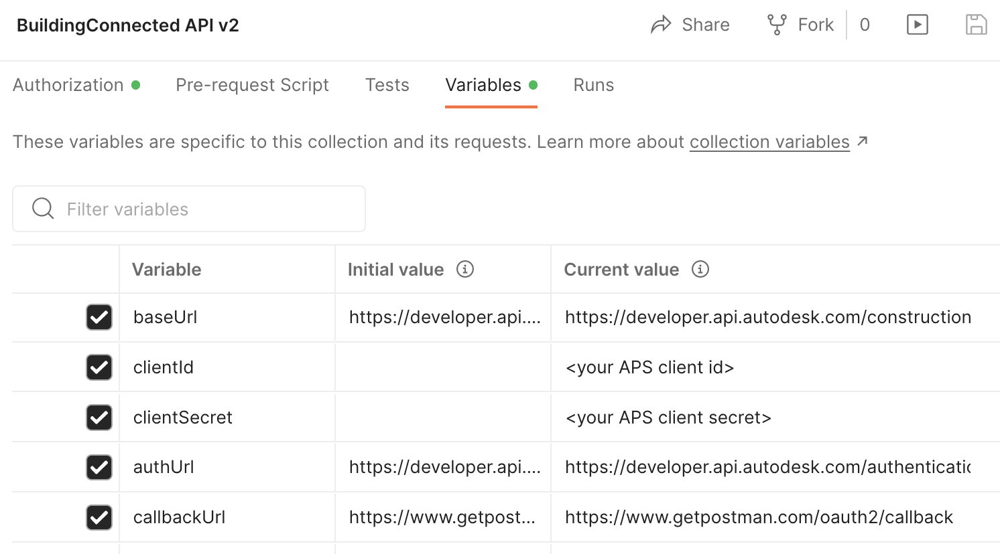

# Postman Collection for BuildingConnected API

[](https://www.getpostman.com/)

[](https://aps.autodesk.com/en/docs/oauth/v2/overview/)

[](https://aps.autodesk.com/en/docs/buildingconnected/v2/developers_guide/overview/)
 

[](http://opensource.org/licenses/MIT)


## Description
This folder contains a Postman Collection that includes all the endpoints of current BuildingConnected API and the demo tutorials. The collection will be kept updated with new APIs. 


### Setup Postman environment

- Import Postman collection file. It contains the endpoints test, predefined **variables** of collection enviroment and predefined **Authorization**.  

- Input your information in  **variables** tab 


    <p align="center"></p>  

- ensure the callback url of your APS application is 
```https://www.getpostman.com/oauth2/callback```


### API Test

1. Assume the steps of **Setup** have been performed. The 3-legged token is ready.

2. Play the scripts, try to change some parameters or body with more scenarios. If you want to investigate data of specific project, call List Projects firstly to get its id, and use it as filter in other endpoints.

3. To test tutorial. Run the steps. Some steps are not scripts. They are notes on what might be proceeded after you get the data from previous steps. 
 

### Documentation

- [BuildingConnected API Field Guid](https://aps.autodesk.com/en/docs/buildingconnected/v2/developers_guide/field_guide/)
- [BuildingConnected API API Reference](https://aps.autodesk.com/en/docs/buildingconnected/v2/reference/http/buildingconnected-projects-GET/)
- [BuildingConnected API Tutorial](https://aps.autodesk.com/en/docs/buildingconnected/v2/tutorials/create-etl-process/)


### License
This sample is licensed under the terms of the [MIT License](http://opensource.org/licenses/MIT). Please see the [LICENSE](../LICENSE) file for full details.

### Written by
Xiaodong Liang [@coldwood](https://twitter.com/coldwood), [Developer Advocate and Support](http://aps.autodesk.com)

